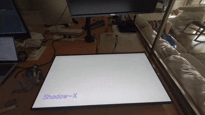
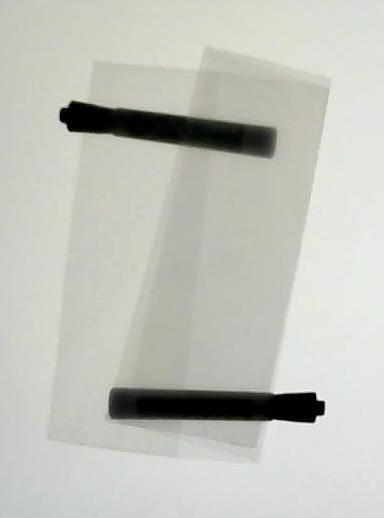
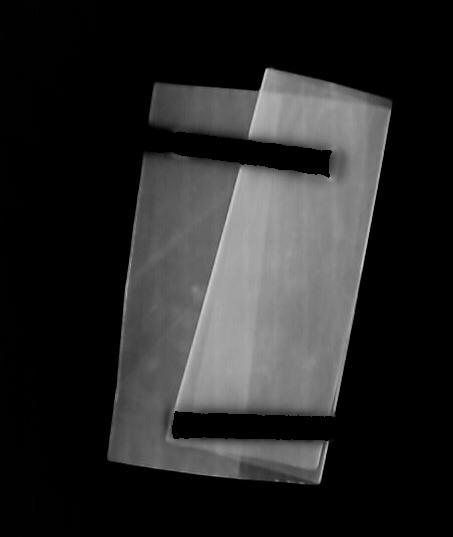

# shadow-x

## Purpose
Sensitive imaging using a computer controlled back-illuminated screen with camera feedback.

## Setup
- Screen lays flat on the table.
- Camera is placed above the screen.
- Samples are placed on a glass surface a couple cm above the screen.

## Camera-to-screen mapping
We use a circle grid pattern to register the screen positions of each pixel on the camera. 
Then we have a mapping from camera coordinates to screen coordinates.

## Applications

### Synthetic shadow 
Objects between the screen and the camera are detected in the camera image.
The mask of these objects is then mapped to the screen, creating am illusion of a shadow on the screen.



Run:
[shadow.py](shadow.py)

### Darkfield illumination

The backlight screen is illuminated and imaged with moving stripes.
Each pixel is averaged over images where it is in a dark stripe. 
This technique thereby simulates darkfield illumination, where the signal in each pixel is proportional to scattering, not transmission. 

Example of a plastic bag taken in normal bright-field illumination and synthetic dark-field illumination:




Run:
[dark_field.py](dark_field.py)

### Fluorescence imaging (Experimental)

Experimental fluorescence imaging using colored screen illumination as excitation light source.

**Requirements:** Emission filter on camera (critical!), bright fluorophores, dark environment.

#### Simple Fluorescence
```bash
python quick_fluorescence_test.py
```
Edit `EXCITATION_RGB` in the file to change excitation color (e.g., `(0, 0, 255)` for blue/GFP).

#### Fluorescence Darkfield (colored stripes)
```bash
python quick_fluorescence_darkfield_test.py
```
Edit `STRIPE_COLOR` in the file. Uses colored moving stripes - combines darkfield with fluorescence excitation.

## Macroscope Environment

This repository has been adapted to support macroscope environments. The project uses the same `macroscope` conda environment as NewMacroscope.

**Note:** This branch (`macroscope-adaptation`) defaults to the macroscope environment configuration. No environment variable needed!

### Quick Start

1. Activate your macroscope conda environment:
   ```powershell
   conda activate macroscope
   ```

2. Update environment with dependencies (if needed):
   ```powershell
   conda env update -f environment.yml
   ```
   See `environment.yml` for the complete dependency list.

3. Configure your macroscope settings in `env_macroscope.py` (camera index, screen coordinates, etc.)

4. Run the scripts:
   ```powershell
   python shadow.py
   python dark_field.py
   ```

5. (Optional) To switch back to shadow-x environment:
   ```powershell
   $env:SHADOW_X_ENV = "shadow-x"
   ```


